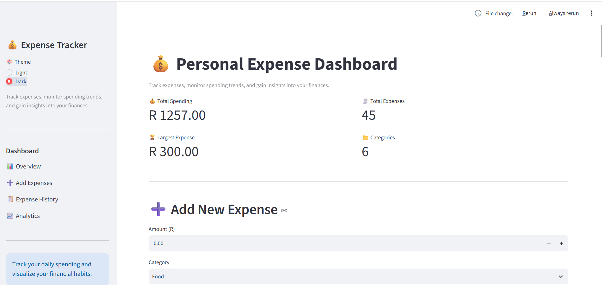
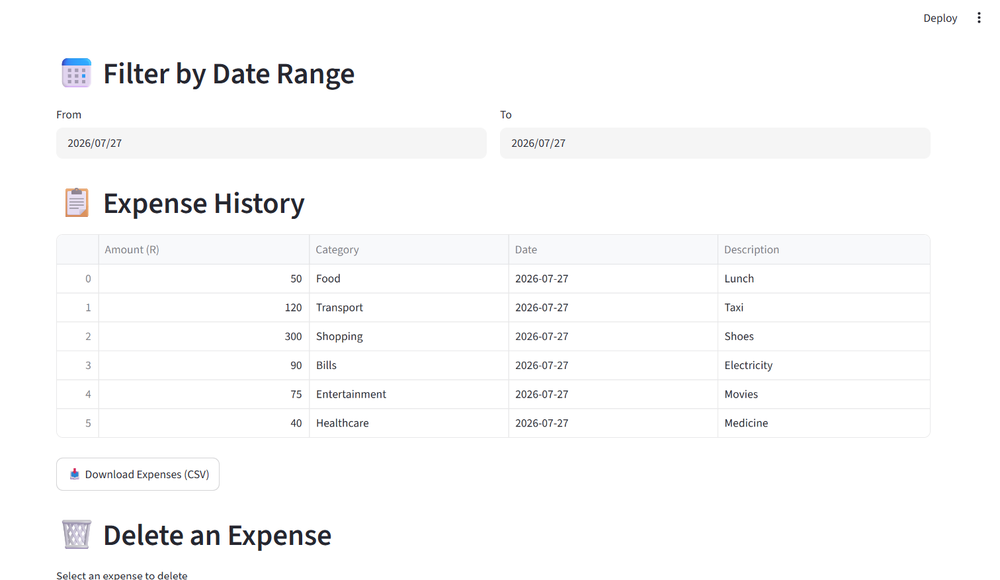
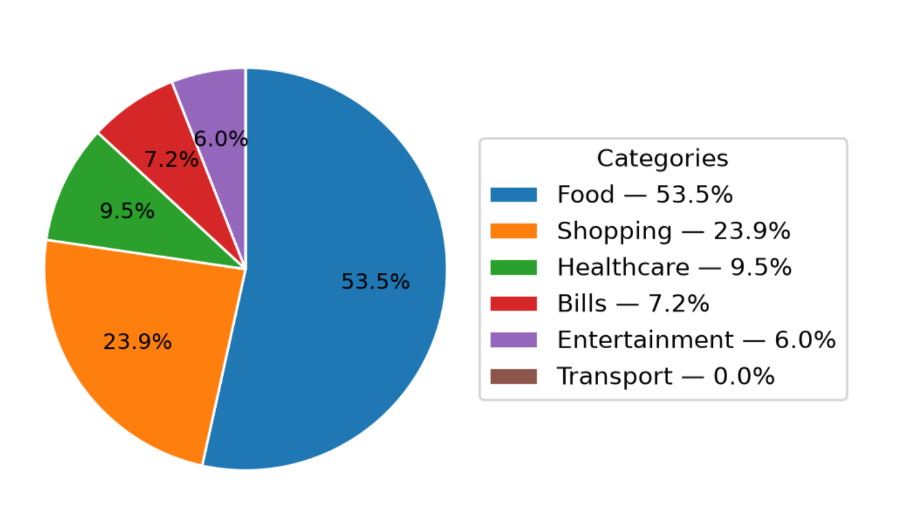

# 💰 Personal Expense Tracker

A modern **Personal Expense Tracker** built with **Python, Streamlit, SQLite, Pandas, and Matplotlib**.

This application helps users record daily expenses, monitor spending habits, visualize financial data, and export reports.

---

## 📸 Application Preview

## 📸 Application Preview

### Dashboard



### Expense History



### Analytics



### Dashboard


### Analytics


---

## ✨ Features

- 💰 Add new expenses
- 🗑️ Delete expenses
- 📊 Dashboard with key metrics
- 📅 Filter expenses by date
- 📂 Filter expenses by category
- 📈 Monthly spending trend
- 🥧 Expense distribution pie chart
- 📊 Spending by category bar chart
- 📥 Export expenses to CSV
- 💾 SQLite database for persistent storage

---

## 🛠️ Technologies Used

- Python
- Streamlit
- SQLite
- Pandas
- Matplotlib

---

## 📂 Project Structure

```text
Expense Tracker/
│
├── .streamlit/
│   └── config.toml
│
├── assets/
│
├── app.py
├── database.py
├── charts.py
├── styles.py
├── utils.py
├── requirements.txt
├── README.md
└── .gitignore
```

---

## 🚀 Installation

### Clone the repository

```bash
git clone https://github.com/YOUR_USERNAME/expense-tracker.git
```

### Navigate into the project

```bash
cd expense-tracker
```

### Install dependencies

```bash
pip install -r requirements.txt
```

### Run the application

```bash
streamlit run app.py
```

---

## 📊 Dashboard Features

- Total Spending
- Total Expenses
- Largest Expense
- Number of Categories

---

## 📈 Analytics

The dashboard includes:

- Monthly Spending Trend
- Category Spending Analysis
- Expense Distribution
- Interactive Charts

---

## 📥 Export

Users can download all filtered expense records as a CSV file.

---

## 🔮 Future Improvements

- 🔐 User authentication
- ☁️ Cloud database integration
- 💵 Budget planning
- 📱 Mobile-friendly layout
- 📄 PDF reports
- 🔔 Spending alerts
- 🌍 Multi-currency support

---

## 👨‍💻 Author

** Ntombifuthi Tanya Ndlovu**

Bachelor of Information Science (BIS) Graduate

Passionate about Software Engineering, Data Analytics, and Building Practical Applications with Python.

---

## 📄 License

This project is licensed under the MIT License.